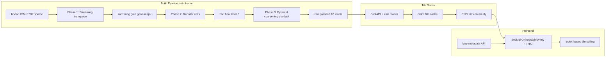
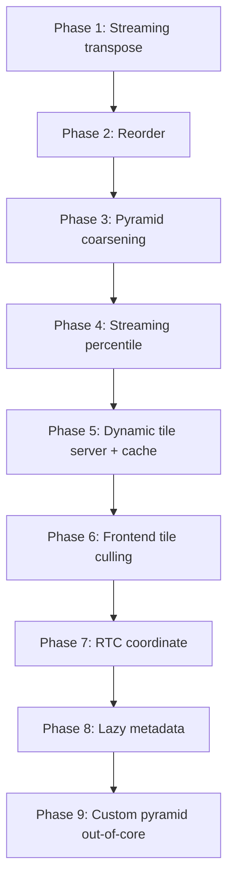

# 🎯 Kế hoạch Khả thi: Heatmap 20 Triệu Tế bào

> Phương án thực thi cụ thể, từng bước, dựa trên đánh giá `100M_CELLS_EVALUATION.md` và phân tích code hiện tại.
> Mục tiêu: **20M cells × 20K genes** — khả thi trên phần cứng 32 GB RAM + 1 TB NVMe SSD.

---

## Tổng quan số liệu

| Thông số | Hiện tại (PBMC 3k) | Mục tiêu 20M |
|---|---|---|
| Tế bào (cells) | 2.638 | 20.000.000 |
| Gen (genes) | 50.402 | 20.000 |
| Phần tử ma trận | 133 triệu | 400 tỷ (400 billion) |
| Non-zero (sparse ~95%) | ~130 nghìn | ~20 tỷ (20 billion) |
| Dense float32 | ~5 MB | **1,6 TB** (KHÔNG load vào RAM) |
| Zarr trên đĩa (nén zstd) | ~50 MB | **~150–250 GB** |
| Số levels pyramid | 7 | **18** (level 0→17) |
| Số ô level 0 (256×256) | ~12 | **~6,2 triệu** |
| `cell_order` trong meta.json | ~21 KB | **160 MB** (phải bỏ) |

### Vì sao 20M khả thi nhưng 100M thì chưa

| Tiêu chí | 20M | 100M |
|---|---|---|
| Float32 precision (2^24 = 16,7M) | Vượt nhẹ → cần RTC | Vượt nhiều → RTC bắt buộc |
| Zarr disk (nén) | ~150–250 GB (1 TB SSD OK) | ~750 GB–1,2 TB (cần nhiều SSD) |
| Build time (chunked) | Vài giờ (1 máy) | Vài ngày (cần cluster) |
| Tile server latency | < 5ms OK (NVMe) | < 5ms khó hơn (I/O lớn hơn) |

---

## Kiến trúc tổng thể



---

## Phân tích nút thắt hiện tại

### Bottleneck 1: `_load_matrix` materialize toàn bộ dense

[`_load_matrix`](backend/build_pyramid.py:34) gọi `mat.toarray()` → chuyển toàn bộ sparse thành dense trong RAM.

```
20M × 20K × float32 = 1,6 TB → OOM ngay lập tức
```

**Đây là blocker #1.** Phải thay bằng chunked streaming.

### Bottleneck 2: Reorder toàn ma trận

[`mat[:, order]`](backend/build_pyramid.py:107) cần toàn bộ ma trận dense để reorder cột.

### Bottleneck 3: Percentile trên toàn ma trận

[`mat[mat > 0]`](backend/build_pyramid.py:113) + `np.percentile(sample, 1)` cần load tất cả non-zero values.

### Bottleneck 4: `cell_order` trong meta.json

[`"cell_order": order.tolist()`](backend/build_pyramid.py:252) → 20M × 8 byte = 160 MB JSON. Frontend [`fetchMeta`](client/src/api.ts:37) load toàn bộ → chậm + tốn RAM.

### Bottleneck 5: `/api/obs` load toàn bộ cell_ids

[`root["cell_ids"][:].tolist()`](backend/server.py:154) → 20M strings → JSON khổng lồ → browser OOM.

### Bottleneck 6: `computeVisibleTiles` quét toàn bộ ô

[`for (r = 0; r < nRows; r++)`](client/src/HeatmapTileLayer.ts:104) lặp qua **tất cả** ô ở level đã chọn. Ở level 0: 6,2 triệu ô → treo khi zoom in.

### Bottleneck 7: Float32 precision

20M > 16,7M (2^24) → jitter ở tọa độ tuyệt đối. Cần RTC (Relative-To-Center).

### Bottleneck 8: Custom pyramid load toàn bộ level 0

[`arr0[idx, :]`](backend/server.py:227) → load toàn bộ level 0 (1,6 TB) vào RAM để chọn gene subset.

### Bottleneck 9: Static PNG quá nhiều file

[`generate_pyramid.py`](backend/generate_pyramid.py) tạo 6,2M+ file PNG ở level 0 → inode exhaustion. **Phải bỏ, dùng dynamic.**

---

## Kế hoạch 8 giai đoạn

### Phase 1: Out-of-core streaming transpose (sparse → gene-major zarr)

**Mục tiêu:** Chuyển ma trận sparse (n_cells × n_genes) từ h5ad sang dense zarr (n_genes × n_cells) KHÔNG load toàn bộ vào RAM.

**Chiến lược:** Đọc theo cell-chunk, densify, transpose, ghi theo gene-chunk vào zarr trung gian.

```python
# Pseudocode — backend/build_pyramid.py (thay _load_matrix)
def build_level0_streaming(h5ad_path, zarr_interim, tile_size=256):
    adata = read_h5ad(h5ad_path, backed='r')  # lazy, không load X
    n_cells, n_genes = adata.n_obs, adata.n_vars

    # Tạo zarr trung gian: shape (n_genes, n_cells), chunk (256, 256)
    store = zarr.DirectoryStore(zarr_interim)
    root = zarr.group(store=store, overwrite=True)
    arr = root.zeros("level_0_raw",
        shape=(n_genes, n_cells),
        chunks=(tile_size, tile_size),
        dtype="f4",
        compressor=zarr.Blosc(cname="zstd", clevel=3),
    )

    # Đọc theo cell-chunk (trục cell = trục dài 20M)
    CELL_CHUNK = 50_000  # 50K cells × 20K genes × 4B = 4 GB — vừa RAM
    for c0 in range(0, n_cells, CELL_CHUNK):
        c1 = min(c0 + CELL_CHUNK, n_cells)
        # Đọc sparse slice từ h5ad (backed mode)
        sparse_block = adata.X[c0:c1, :]  # (50K, 20K) sparse CSR
        dense_block = sparse_block.toarray()  # (50K, 20K) = 4 GB
        # Transpose: (n_genes, n_cells) — gene-major
        transposed = dense_block.T  # (20K, 50K)
        # Ghi theo gene-chunk vào zarr
        for g0 in range(0, n_genes, tile_size):
            g1 = min(g0 + tile_size, n_genes)
            # Ghi (256 genes, 50K cells) vào zarr — zarr tự chia chunk
            arr[g0:g1, c0:c1] = transposed[g0:g1, :]
        print(f"[build] transposed {c1}/{n_cells} cells")
```

**Bộ nhớ:** ~8 GB peak (dense_block 4GB + transposed 4GB). Vừa 16 GB RAM.
**Đĩa:** zarr trung gian ~150–250 GB (nén zstd, 95% zero nén tốt).
**Lưu ý:** Không reorder ở bước này — chỉ transpose. Reorder ở Phase 2.

**Files cần sửa:**
- [`backend/build_pyramid.py`](backend/build_pyramid.py) — thêm hàm `build_level0_streaming`, thay `_load_matrix`
- [`backend/config.py`](backend/config.py) — thêm `CELL_CHUNK_SIZE`, `ZARR_INTERIM_PATH`

---

### Phase 2: Streaming cluster reorder (từ zarr trung gian → zarr final)

**Mục tiêu:** Reorder cells theo cluster mà KHÔNG load toàn bộ ma trận.

**Chiến lược:** Tính permutation từ obs (nhỏ), rồi gather từng tile 256×256 từ zarr trung gian theo thứ tự đã reorder.

```python
def reorder_cells(zarr_interim, zarr_final, adata, tile_size=256):
    # 1. Tính order từ obs (chỉ cần obs, ~20M × vài byte = nhỏ)
    order = _cluster_order(adata)  # 20M × int32 = 80 MB — vừa RAM

    # 2. Mở zarr trung gian (gene-major, original order)
    src = zarr.open(f"{zarr_interim}/level_0_raw", mode='r')
    n_genes, n_cells = src.shape

    # 3. Tạo zarr final level 0
    store = zarr.DirectoryStore(zarr_final)
    root = zarr.group(store=store, overwrite=True)
    dst = root.zeros("level_0",
        shape=(n_genes, n_cells),
        chunks=(tile_size, tile_size),
        dtype="f4",
        compressor=zarr.Blosc(cname="zstd", clevel=3),
    )

    # 4. Gather từng tile 256×256 theo thứ tự reordered
    n_gene_tiles = (n_genes + tile_size - 1) // tile_size   # ~79
    n_cell_tiles = (n_cells + tile_size - 1) // tile_size   # ~78125
    for gt in range(n_gene_tiles):
        g0 = gt * tile_size
        g1 = min(g0 + tile_size, n_genes)
        for ct in range(n_cell_tiles):
            # Lấy 256 cell indices ĐÃ REORDER
            c_start = ct * tile_size
            c_end = min(c_start + tile_size, n_cells)
            reordered_indices = order[c_start:c_end]  # 256 int32
            # Gather: đọc 256 cells (theo reordered order) cho 256 genes
            block = src.oindex[g0:g1, reordered_indices]  # (256, 256) — zarr fancy indexing
            dst[g0:g1, c_start:c_end] = block
        print(f"[reorder] gene tile {gt+1}/{n_gene_tiles}")
```

**Bộ nhớ:** 256×256×4 = 256 KB per tile + 80 MB permutation. Tối thiểu.
**I/O:** ~6,2M tile reads + writes. Zarr đọc theo chunk — mỗi read chỉ load 1 chunk 256KB.
**Lưu ý:** `oindex` (orthogonal indexing) của zarr hỗ trợ fancy indexing trên 1 trục mà không load toàn bộ.

**Files cần sửa:**
- [`backend/build_pyramid.py`](backend/build_pyramid.py) — thêm hàm `reorder_cells`, tích hợp vào `build()`

---

### Phase 3: Out-of-core pyramid coarsening (dask)

**Mục tiêu:** Tạo 18 levels pyramid từ level 0 bằng 2×2 mean-pool, out-of-core.

**Chiến lược:** Dask đọc level N từ zarr, coarsen, ghi level N+1. Mỗi level nhỏ hơn level trước 4 lần.

```python
def build_pyramid_levels(zarr_final, tile_size=256):
    root = zarr.open(zarr_final, mode='r+')
    arr0 = root["level_0"]
    n_genes, n_cells = arr0.shape

    # Đếm số levels: halving cho đến khi cả 2 trục ≤ tile_size
    max_level = 0
    h, w = n_genes, n_cells
    while h > tile_size or w > tile_size:
        h, w = h // 2, w // 2
        max_level += 1
    n_levels = max_level + 1  # = 18 cho 20K × 20M

    # Dask đọc level 0 out-of-core
    current = da.from_zarr(arr0)  # lazy, không load RAM

    for level in range(1, n_levels):
        # 2×2 mean-pool (dask lazy)
        coarse = _coarsen_mean(current, 2)
        h_l, w_l = coarse.shape
        chunks = (min(tile_size, h_l), min(tile_size, w_l))
        coarse = coarse.rechunk(chunks)
        # Ghi vào zarr
        z = root.zeros(f"level_{level}",
            shape=(h_l, w_l), chunks=chunks, dtype="f4",
            compressor=zarr.Blosc(cname="zstd", clevel=3), overwrite=True)
        coarse.to_zarr(z.store, component=z.path, overwrite=True)
        current = da.from_zarr(z)  # đọc lại lazy cho level tiếp theo
        print(f"[pyramid] level {level}: {h_l} × {w_l}")
```

**Bộ nhớ:** Dask xử lý từng chunk 256×256 = 256 KB. RAM tối thiểu.
**Disk:** Tổng tất cả levels ≈ 4/3 × level 0 (geometric series) ≈ ~200–330 GB.
**Lưu ý:** `_coarsen_mean` đã có sẵn trong code hiện tại — dùng `da.coarsen(np.nanmean, ...)`. Dask tự chunk và parallel.

**Files cần sửa:**
- [`backend/build_pyramid.py`](backend/build_pyramid.py) — refactor phần pyramid loop, dùng `da.from_zarr` thay `da.from_array`

---

### Phase 4: Streaming percentile (không load toàn bộ)

**Mục tiêu:** Tính vmin/vmax (percentile 1/99) mà không load toàn bộ 20 tỷ non-zero.

**Chiến lược:** Lấy mẫu ngẫu nhiên từ zarr level 0, tính percentile trên mẫu.

```python
def compute_vmin_vmax(zarr_path, sample_size=10_000_000):
    """Approximate percentile từ random sample của level 0."""
    root = zarr.open(zarr_path, mode='r')
    arr = root["level_0"]
    n_genes, n_cells = arr.shape

    # Random sample: chọn random gene-chunks và cell-chunks
    rng = np.random.default_rng(42)
    n_gene_chunks = (n_genes + 255) // 256
    n_cell_chunks = (n_cells + 255) // 256
    # Chọn ~4000 random chunks → ~4000 × 256² = 262M values → đủ cho percentile
    n_sample_chunks = max(100, sample_size // (256 * 256))
    g_chunks = rng.integers(0, n_gene_chunks, size=n_sample_chunks)
    c_chunks = rng.integers(0, n_cell_chunks, size=n_sample_chunks)

    samples = []
    for g, c in zip(g_chunks, c_chunks):
        block = arr[g*256:(g+1)*256, c*256:(c+1)*256]
        vals = block[np.isfinite(block) & (block > 0)]
        if vals.size:
            samples.append(vals.ravel())

    all_samples = np.concatenate(samples)
    vmin = float(np.percentile(all_samples, 1))
    vmax = float(np.percentile(all_samples, 99))
    return vmin, vmax
```

**Bộ nhớ:** ~262M × 4 byte = ~1 GB sample. Vừa RAM.
**Độ chính xác:** 10M sample từ 400 tỷ → sai số < 0,1% cho percentile 1/99. Đủ cho colormap.

**Files cần sửa:**
- [`backend/build_pyramid.py`](backend/build_pyramid.py:113) — thay `np.percentile(mat[mat > 0], ...)` bằng `compute_vmin_vmax`

---

### Phase 5: Dynamic tile server + disk LRU cache + async

**Mục tiêu:** Serve PNG tiles on-the-fly từ zarr, < 5ms/tile, cache trên disk.

**5a. Bỏ static PNG, dùng dynamic (đã có sẵn `/api/tile`)**

Endpoint [`/api/tile/{level}/{row}/{col}`](backend/server.py:134) đã đọc từ zarr và render PNG. Chỉ cần:
- Vô hiệu hóa [`generate_pyramid.py`](backend/generate_pyramid.py) (không chạy cho 20M)
- Frontend chuyển từ [`tileUrl`](client/src/api.ts:70) (`/tiles/...`) sang dynamic `/api/tile/...`

**5b. Disk LRU cache**

```python
# backend/tile_cache.py (file mới)
import hashlib, shutil
from pathlib import Path
from functools import lru_cache
import diskcache  # pip install diskcache

CACHE_DIR = Path(os.environ.get("HEATMAP_CACHE_DIR", "data/tile_cache"))
CACHE_MAX_SIZE = int(os.environ.get("HEATMAP_CACHE_GB", "20")) * 1_000_000_000

_cache = diskcache.Cache(str(CACHE_DIR), size_limit=CACHE_MAX_SIZE)

def get_or_render(level, row, col, render_fn):
    key = f"{level}/{row}/{col}"
    png = _cache.get(key)
    if png is None:
        png = render_fn(level, row, col)
        _cache.set(key, png, expire=86400)  # 24h TTL
    return png
```

**5c. Async endpoint + worker pool**

```python
# server.py — chuyển sang async
@app.get("/api/tile/{level}/{row}/{col}")
async def get_tile(level: int, row: int, col: int):
    png = await asyncio.to_thread(_serve_tile, level, row, col)
    return Response(content=png, media_type="image/png")

def _serve_tile(level, row, col):
    key = f"{level}/{row}/{col}"
    cached = _cache.get(key)
    if cached:
        return cached
    block = _store.tile(level, row, col)
    png = render_tile_png(block, vmin, vmax)
    _cache.set(key, png)
    return png
```

Chạy uvicorn với nhiều workers: `uvicorn --workers 4`.

**5d. Pre-warm cache cho top levels**

Top levels nhỏ (level 17 = 1 tile, level 16 = ~4 tiles, ... level 10 = ~few thousand). Pre-render tất cả tiles từ level 10 trở lên khi server khởi động.

**Files cần tạo/sửa:**
- [`backend/tile_cache.py`](backend/tile_cache.py) — **file mới**, disk LRU cache
- [`backend/server.py`](backend/server.py) — async endpoint, tích hợp cache
- [`backend/config.py`](backend/config.py) — thêm `CACHE_DIR`, `CACHE_MAX_SIZE`
- [`client/src/api.ts`](client/src/api.ts:70) — `tileUrl` trỏ sang `/api/tile/...`
- `pyproject.toml` — thêm `diskcache>=5.6.12`

---

### Phase 6: Frontend index-based tile culling

**Mục tiêu:** `computeVisibleTiles` không quét 6,2M ô, chỉ tính range ô trong viewport.

**Vấn đề hiện tại:** [`for (r = 0; r < nRows; r++)`](client/src/HeatmapTileLayer.ts:104) lặp toàn bộ.

**Giải pháp:** Tính start/end tile index trực tiếp từ viewport bounds.

```typescript
// HeatmapTileLayer.ts — computeVisibleTiles rewrite
export function computeVisibleTiles(meta, target, zoom, width, height, layout) {
  const { tile_size: TILE, levels, n_levels } = meta;
  const maxLevel = n_levels - 1;

  let level = Math.floor(-zoom);
  level = Math.max(0, Math.min(maxLevel, level));

  const [h, w] = levels[level];
  const downsample = Math.pow(2, level);
  const tileWorldW = TILE * downsample;
  const tileWorldH = TILE * downsample;

  const visW = width / Math.pow(2, zoom);
  const visH = height / Math.pow(2, zoom);
  const west = target[0] - visW / 2;
  const east = target[0] + visW / 2;
  const north = target[1] - visH / 2;
  const south = target[1] + visH / 2;

  // Y axis (genes): tuyến tính, tính trực tiếp
  const r0 = Math.max(0, Math.floor(north / tileWorldH));
  const r1 = Math.min(Math.ceil(h / TILE) - 1, Math.floor(south / tileWorldH));
  const vExtent_base = Math.min(1, (h - r0 * TILE) / TILE);

  // X axis (cells): nếu KHÔNG có layout (gap=0) → tuyến tính
  // Nếu CÓ layout → binary search tìm tile col đầu/cuối trong viewport
  let c0, c1;
  if (!layout || layout.gapSize <= 0) {
    c0 = Math.max(0, Math.floor(west / tileWorldW));
    c1 = Math.min(Math.ceil(w / TILE) - 1, Math.floor(east / tileWorldW));
  } else {
    // Binary search: tìm raw col đầu tiên có worldX >= west
    c0 = binarySearchFirstTileCol(layout, west, TILE, downsample, w);
    c1 = binarySearchLastTileCol(layout, east, TILE, downsample, w);
  }

  const tiles: VisibleTile[] = [];
  for (let r = r0; r <= r1; r++) {
    const y0 = r * tileWorldH;
    const y1 = (r + 1) * tileWorldH;
    const vExtent = Math.min(1, (h - r * TILE) / TILE);
    for (let c = c0; c <= c1; c++) {
      const startCol = c * TILE * downsample;
      const endCol = (c + 1) * TILE * downsample;
      const x0 = layout ? layout.mapColToWorldX(startCol) : c * tileWorldW;
      const x1 = layout ? layout.mapColToWorldX(endCol) : (c + 1) * tileWorldW;
      const uExtent = Math.min(1, (w - c * TILE) / TILE);
      tiles.push({ level, row: r, col: c, bounds: [...], dataExtent: [uExtent, vExtent] });
    }
  }
  return tiles;
}
```

**Hiệu năng:** Chỉ lặp `(r1-r0+1) × (c1-c0+1)` ô — thường 50–200 ô. Thay vì 6,2M.

**Files cần sửa:**
- [`client/src/HeatmapTileLayer.ts`](client/src/HeatmapTileLayer.ts:55) — rewrite `computeVisibleTiles`, thêm `binarySearchFirstTileCol` / `binarySearchLastTileCol`

---

### Phase 7: RTC coordinate system (Float32 precision)

**Mục tiêu:** Khắc phục jitter do Float32 không đủ precision cho 20M.

**Vấn đề:** Float32 có 23-bit mantissa = 16.777.216 giá trị nguyên chính xác. 20M > 16,7M → sai số 1–16 pixel ở tọa độ tuyệt đối.

**Giải pháp:** Dùng `coordinateOrigin` trong OrthographicView — deck.gl 9.x hỗ trợ RTC qua `coordinateOrigin`.

```typescript
// HeatmapView.tsx
import { COORDINATE_SYSTEM } from "@deck.gl/core";

// View state: target luôn gần 0 (relative to center)
// Thay vì target = [10M, 10K, 0] (tọa độ tuyệt đối)
// Dùng: coordinateOrigin = [centerX, centerY, 0], target = [0, 0, 0]

const view = new OrthographicView({
  coordinateSystem: COORDINATE_SYSTEM.CARTESIAN,
  coordinateOrigin: [centerX, centerY, 0],  // RTC origin
});

// Khi pan: cập nhật coordinateOrigin thay vì target
// Tiles bounds: tính relative to coordinateOrigin
function tileBounds(tile, layout, coordinateOrigin) {
  const worldX = layout.mapColToWorldX(tile.startCol);
  const relX = worldX - coordinateOrigin[0];  // luôn < viewport/2 < 1M
  return [relX, ...];
}
```

**Thay đổi cụ thể:**
- [`client/src/HeatmapView.tsx`](client/src/HeatmapView.tsx:187) — thêm `coordinateOrigin` vào viewState, tính bounds relative
- [`client/src/HeatmapTileLayer.ts`](client/src/HeatmapTileLayer.ts:55) — `computeVisibleTiles` trừ `coordinateOrigin` khi tính viewport bounds
- [`client/src/SpatialLayout.ts`](client/src/SpatialLayout.ts:71) — `mapColToWorldX` có thể cần trả relative coords

**Lưu ý:** Đây là thay đổi phức tạp nhất ở frontend. Cần test kỹ. Có thể tách thành 2 bước:
1. Bước nhẹ: chỉ thêm `coordinateOrigin` mà không đổi logic bounds (giảm jitter một phần)
2. Bước đầy đủ: chuyển toàn bộ sang relative coords

---

### Phase 8: Lazy metadata fetch + bỏ cell_order khỏi meta

**Mục tiêu:** Frontend không load 20M cell_ids + 160MB cell_order.

**8a. Bỏ `cell_order` khỏi meta.json**

```python
# build_pyramid.py — XÓA dòng:
# "cell_order": order.tolist(),  # 160 MB — bỏ!

# Thay bằng: lưu order vào zarr array riêng (lazy, không load vào meta)
root.array("cell_order", order, dtype="i4", chunks=(tile_size,), overwrite=True)
```

**8b. Range-based `/api/obs` endpoint**

```python
# server.py — thay /api/obs (load all) bằng /api/obs/range
@app.get("/api/obs/range")
def get_obs_range(start: int, end: int):
    """Return cell metadata for a range [start, end) — for lazy axis labels."""
    root = _store.root
    cell_ids = root["cell_ids"][start:end].tolist()
    out = {"cell_ids": cell_ids, "start": start, "end": end}
    if "louvain" in root:
        out["louvain"] = root["louvain"][start:end].tolist()
    return out

# Giữ /api/obs cũ cho backward compat nhưng thêm warning cho large datasets
```

**8c. Frontend lazy fetch**

```typescript
// HeatmapView.tsx — KHÔNG fetch toàn bộ obs khi load
// Chỉ fetch range khi zoom đủ để thấy cell labels

// Bỏ: fetchObs() trong useEffect mount
// Thêm: fetchObsRange(start, end) khi viewport zoom > threshold

const VISIBLE_CELL_THRESHOLD = 5000;  // chỉ hiện label khi < 5K cells visible

useEffect(() => {
  if (!meta || !layout) return;
  const zoom = viewState.zoom;
  const visW = size.width / Math.pow(2, zoom);
  const startCol = Math.max(0, Math.floor(viewState.target[0] - visW/2));
  const endCol = Math.min(meta.n_cells, Math.ceil(viewState.target[0] + visW/2));
  const nVisible = endCol - startCol;
  if (nVisible > VISIBLE_CELL_THRESHOLD) {
    setObs(null);  // ẩn labels, quá nhiều
    return;
  }
  fetchObsRange(startCol, endCol).then(setObs);
}, [viewState, meta, layout, size]);
```

**8d. UMAP lazy (nếu cần)**

UMAP = 20M × 2 × float32 = 160 MB. Lưu trong zarr, fetch theo range tương tự.

**Files cần sửa:**
- [`backend/build_pyramid.py`](backend/build_pyramid.py:252) — bỏ `cell_order` khỏi meta, lưu vào zarr array
- [`backend/server.py`](backend/server.py:149) — thêm `/api/obs/range`, deprecate `/api/obs`
- [`client/src/api.ts`](client/src/api.ts:42) — thêm `fetchObsRange`
- [`client/src/HeatmapView.tsx`](client/src/HeatmapView.tsx:91) — lazy fetch obs theo viewport

---

### Phase 9 (bonus): Out-of-core custom pyramid (gene subset)

**Mục tiêu:** Custom pyramid không load 1,6 TB level 0 vào RAM.

**Vấn đề:** [`arr0[idx, :]`](backend/server.py:227) load toàn bộ level 0.

**Giải pháp:** Đọc gene rows từ zarr, ghi custom zarr, build pyramid từ đó.

```python
# server.py — CustomPyramid.build rewrite
def build(self, gene_indices):
    _store.open()
    arr0 = _store.array(0)
    n_genes_full, n_cells = arr0.shape
    idx = np.asarray(gene_indices, dtype=np.int64)
    n_sel = len(idx)

    # Tạo custom zarr (KHÔNG in-memory)
    cid = uuid.uuid4().hex[:12]
    custom_zarr = ZARR_PATH.parent / f"custom_{cid}"
    store = zarr.DirectoryStore(custom_zarr)
    root = zarr.group(store=store, overwrite=True)
    # Ghi level 0: chỉ chọn gene rows, giữ tất cả cells
    custom_arr = root.zeros("level_0",
        shape=(n_sel, n_cells), chunks=(TILE_SIZE, TILE_SIZE),
        dtype="f4", compressor=zarr.Blosc(cname="zstd"))
    for i, g in enumerate(idx):
        # Đọc 1 gene row (20M × 4 = 80 MB) — vừa RAM
        custom_arr[i, :] = arr0[g, :]
    # Build pyramid từ custom zarr (dask)
    # ... same as Phase 3
```

**Lưu ý:** Custom pyramid cho 20M cells vẫn lớn (50 genes × 20M = 4 GB). Lưu trên disk, không RAM.

**Files cần sửa:**
- [`backend/server.py`](backend/server.py:215) — rewrite `CustomPyramid.build` thành out-of-core

---

## Thứ tự ưu tiên thực thi



| Phase | Ưu tiên | Phụ thuộc | Rủi ro |
|---|---|---|---|
| 1 — Streaming transpose | 🔴 Cao | Không | Thấp — pattern rõ ràng |
| 2 — Reorder | 🔴 Cao | Phase 1 | Trung bình — zarr fancy indexing |
| 3 — Pyramid coarsening | 🔴 Cao | Phase 2 | Thấp — dask đã có |
| 4 — Streaming percentile | 🔴 Cao | Phase 2 | Thấp — sampling đơn giản |
| 5 — Dynamic tile + cache | 🔴 Cao | Phase 3 | Thấp — endpoint đã có |
| 6 — Frontend tile culling | 🔴 Cao | Phase 5 | Trung bình — binary search với gaps |
| 7 — RTC coordinate | 🟡 Trung bình | Phase 6 | **Cao** — thay đổi sâu frontend |
| 8 — Lazy metadata | 🟡 Trung bình | Phase 5 | Thấp — pattern rõ ràng |
| 9 — Custom pyramid | 🟢 Thấp | Phase 3 | Trung bình |

---

## Yêu cầu phần cứng

| Thành phần | Tối thiểu | Khuyến nghị |
|---|---|---|
| RAM | 16 GB | 32 GB |
| SSD (zarr + cache) | 500 GB NVMe | 1 TB NVMe |
| CPU | 8 cores | 16+ cores (dask parallel) |
| Network (client-server) | HTTP/2 | HTTP/2 + gzip |

---

## Checklist kiểm tra (validation milestones)

- [ ] **M1 — 1M cells**: Validate pipeline streaming (Phase 1–4) với 1M cells. So sánh output với pipeline cũ (dense) — phải giống nhau.
- [ ] **M2 — 5M cells**: Validate tile server + cache (Phase 5). Tiles render < 5ms.
- [ ] **M3 — 10M cells**: Validate frontend tile culling (Phase 6). Zoom/pan mượt, không treo.
- [ ] **M4 — 20M cells**: Validate RTC (Phase 7). Không jitter ở full zoom.
- [ ] **M5 — 20M cells**: Validate lazy metadata (Phase 8). Browser không OOM.
- [ ] **M6 — 20M cells**: Full end-to-end test. Build → serve → render → interact.

> **Nguyên tắc:** Tăng dần 1M → 5M → 10M → 20M. Không nhảy thẳng 20M.

---

## Tóm tắt thay đổi files

| File | Thay đổi | Phase |
|---|---|---|
| [`backend/build_pyramid.py`](backend/build_pyramid.py) | Rewrite: streaming transpose, reorder, dask pyramid, sampling percentile, bỏ cell_order khỏi meta | 1–4, 8 |
| [`backend/server.py`](backend/server.py) | Async tile endpoint, cache tích hợp, `/api/obs/range`, custom pyramid out-of-core | 5, 8, 9 |
| [`backend/tile_cache.py`](backend/tile_cache.py) | **File mới** — disk LRU cache | 5 |
| [`backend/config.py`](backend/config.py) | Thêm config: chunk sizes, cache dir, interim path | 1, 5 |
| [`backend/generate_pyramid.py`](backend/generate_pyramid.py) | Deprecate / disable cho large datasets | 5 |
| [`client/src/HeatmapTileLayer.ts`](client/src/HeatmapTileLayer.ts) | Rewrite `computeVisibleTiles` — index-based culling + binary search | 6 |
| [`client/src/HeatmapView.tsx`](client/src/HeatmapView.tsx) | RTC coordinateOrigin, lazy obs fetch | 7, 8 |
| [`client/src/api.ts`](client/src/api.ts) | `tileUrl` → dynamic, thêm `fetchObsRange` | 5, 8 |
| [`client/src/SpatialLayout.ts`](client/src/SpatialLayout.ts) | Hỗ trợ relative coords (RTC) | 7 |
| [`pyproject.toml`](pyproject.toml) | Thêm `diskcache` | 5 |
